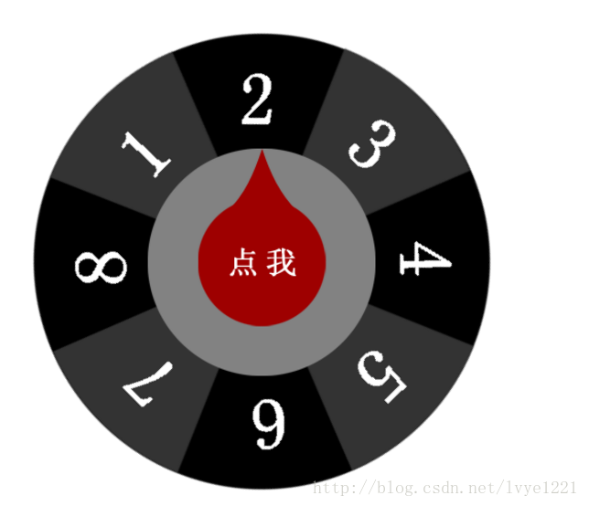

# 抽奖

抽奖功能 的 Web 方式实现，如下图所示：




## 英文单词 ##

lottery: 运气、彩票

# 开发步骤 #

## HTML结构 ##

大盒子里有背景图片和抽奖的指针。分别定义好样式名和id名

```
<div class="lottery-box">
	<div class="plate" id="plate"></div>
	<div class="hand" id="hand"></div>
</div>
```

## 样式修饰 ##
让盒子重合在一起

```

/* 抽奖盘盒子 */
.lottery-box { 
	position: relative;
}

/* 抽奖盘转盘 */
.plate { 
	width: 500px; 
	height: 500px; 
	background: url(img/plate.png) no-repeat;

	/*设置图片的旋转中心位置*/
	transform-origin: 50% 50%;
	/*默认的旋转角度*/
	transform: rotate(0deg);	
}

/* 抽奖盘指针 */
.hand { 
	width: 500px; 
	height: 500px; 
	background:url(img/hand.png) no-repeat; 
	
	/*设置绝对定位，使得转盘和指针可以叠在一起*/
	position:absolute; 
	top: 0px; 
	left: 0px;
}
```

## 动画效果实现 ##

### 引入 JQuery 库 ###

```
<script type="text/javascript" src="js/jquery-1.11.0.js" ></script>
```

### 匀速旋转设置奖项的方式 ###
设置成3等奖

```

// 获取奖牌和手型
var oPlate = $("#plate");
var oHand = $("#hand");

// 奖项设置
var prize = 8;

// 需要找到图片角度与奖项直接的关系
var degree = 360 - (prize - 1) * 45;

// 启动时的角度
var totalDegree = 0;

var deta = 10;

// 启动定时器，定时更新角度
var timer = setInterval(function () {
	
	// 每次增加一定的旋转角度
	totalDegree += deta;
	
	var str = "rotate(" +  totalDegree +"deg)";
	oPlate.css("transform", str);

	// 判断是否到达目标位置
	if (totalDegree >= degree) {
		
		//清除定时器
		clearInterval(timer);
		
		setTimeout(function() {
			alert('恭喜您中了' + prize + '等奖!');
		}, 300);
	}
	
}, 200);
	
```

### 缓冲运动来设置奖项 ###

```
// 开始增加的角度
var deta = degree / 10;


// 定时器中变化的
// 变化量越来越小
deta = (degree - totalDegree) / 10;
// 避免后面增加的角度为0，从而进入死循环
if (deta < 1) {
	deta = 1;
}
```


# 源代码 #

Github 源代码地址：
https://github.com/lvye1221/choujiang.git
